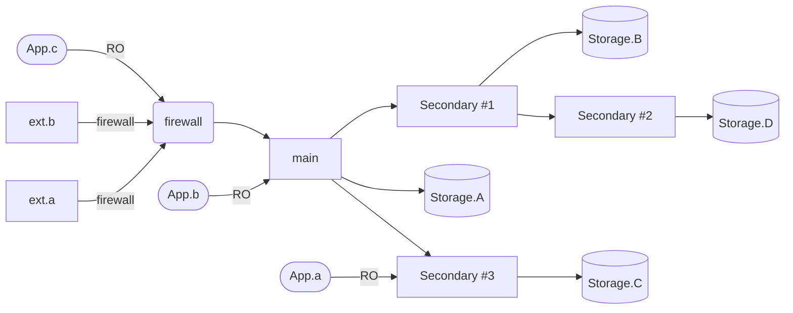

# Distributed SQL

A way to configure a redundant SQLLite database across different nodes.
Intended to federate across an array of Raspberry Pi devices, but should
work across any hardware.

I just made this for fun. There's probably plenty of other well vetted
solutions out there that do roughly the same thing. I didn't look.

## Example Configuration

Below is an example of a four node setup. Below the diagram will explain
what you should expect.

1. `Storage.{A,B,C,D}` should all be eventually consistent.
1. `main` is the only write destination. This will ensure consistency.
1. `App.{a,b,c}` are all read-only apps. Can work from any node. Good for load distribution.
1. Setup as `ext.{a,b}` as public, with `main` behind a firewall. Good for external applications.

## Setup

1. `python3 -m venv env`
1. `source env/bin/activate`
1. `pip install -r requirements.txt`
1. Confirm contents of `config.json`
1. `$(which flask) --app main run --port <port>`

## See stats

1. Visit `127.0.0.1:<port>` and dashboard should load
