# Distributed SQL

A way to configure a redundant SQLLite database across different nodes.
Intended to federate across an array of Raspberry Pi devices, but should
work across any hardware.

I just made this for fun. There's probably plenty of other well vetted
solutions out there that do roughly the same thing. I didn't look. 

```mermaid
graph LR
    RP1[🍓 ext.a] -->|firewall| fw(firewall)
    RP2[🍓 ext.b] -->|firewall| fw(firewall)
    app([📱 App.a]) -->|RO| F
    appb([📱 App.b]) -->|RO| A
    appc([📱 App.c]) -->|RO| fw
    fw --> A
    A[main] --> B[(Storage.A)]
    A[main] --> C[Secondary #1]
    A[main] --> F[Secondary #3]
    C[Secondary #1] --> D[(Storage.B)]
    C[Secondary #1] --> E[Secondary #2]
    F[Secondary #3] --> G[(Storage.C)]
    E[Secondary #2] --> H[(Storage.D)]
```

# Setup

1. `python3 -m venv env`
1. `source env/bin/activate`
1. `pip install -r requirements.txt`
1. `sudo $(which flask) --app main run --port 80`
